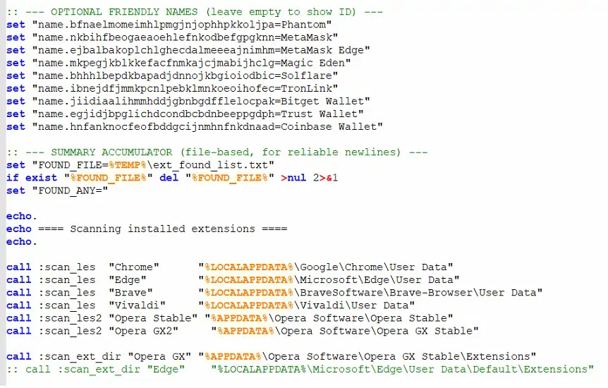

# Compatibility vs Containment

Proton is a compatibility layer that allows games to run on Linux. Proton is built by Valve, the company behind Steam, which is the world’s largest gaming platform by far. By making games playable on Linux, Valve has done unimaginable good for Linux adoption. I run Fedora on my gaming desktop. Proton is what has allowed me to enjoy so many games for the past several years.

With the magic required to get games to run well on Linux, I imagined that Proton forms a sort of containment layer around the Windows application. However, this couldn’t be further from the truth. In fact, Proton is based on Wine, which literally stands for Wine Is Not an Emulator. What security boundary did I then wrongly assume that Proton (or Wine) provides?

I encountered this lack of a security boundary firsthand while I was tinkering around with running games and other Windows applications on Linux. I ran `7zFM.exe` (the File Manager binary for [7-Zip](https://www.7-zip.org/)) and noticed that Proton maps Windows drives to various paths on my Linux system. For example:

- `Z:` is mapped to `/`
- `X:` is mapped to my home directory

This gave me pause for concern. My initial reaction was, why does a game need so much access to run? I briefly considered the risk of compromised developer accounts used to distribute malware via legitimate game updates. Access to my entire disk would give them the ability to harvest my personal data.

I then realised that I was implicitly treating Proton as a sort of security boundary, when this was entirely the wrong mental model to have.

On [its GitHub page](https://github.com/valvesoftware/proton), Proton very clearly states its intent:

> Proton is a tool for use with the Steam client which allows games which are exclusive to Windows to run on the Linux operating system. It uses Wine to facilitate this.

The goal has always been to run games. As many games as possible. In other words, the goal is widespread compatibility, not application isolation. This principle is also inherited from Wine, which clearly states in its FAQ that it [does not do any sandboxing whatsoever](https://gitlab.winehq.org/wine/wine/-/wikis/FAQ#how-good-is-wine-at-sandboxing-windows-apps). Therefore, to desire or assume any form of isolation via Proton is a mistake.

I started reflecting seriously about this because of how frequently supply chain attacks are used to distribute malware. Of all the malware, infostealers really scare me. But you know what’s worse than an infostealer? An infostealer masquerading as a game, available on Steam for anyone including myself to purchase and play.

There are already several examples of games that were hijacked with infostealers. One example is [BlockBlasters](https://blog.gdatasoftware.com/2025/09/38265-steam-blockblasters-game-downloads-malware). You can see an example of a batch script collecting browser profiles and crypto wallet data and sending it to a C2 server.



Figure 1: Malware payload showing a batch script that collects crypto wallet and browser data. ([Source](https://blog.gdatasoftware.com/2025/09/38265-steam-blockblasters-game-downloads-malware))

I wondered, why doesn’t Valve do something about it with Proton? Then, I stumbled across [this heated discussion on GitHub](https://github.com/ValveSoftware/Proton/issues/3979) from 6 years ago discussing this very issue. I found the discussion fascinating, agreeing with arguments from both sides. The issue author questioned why Proton couldn’t just symlink to the directories it needs, like `~/.steam` and the game’s install directory. Proton contributors responded that this is behaviour inherited from Wine, emphasising that Wine’s job is not isolation of applications from the host. The issue is marked as Closed, indicating that Valve likely does not see this as a problem to be fixed.

It turns out that my question had been answered half a decade ago. The mapping of host directories, and a Wine executable having the ability to do anything a host user executable can do, is behaviour that should be expected from Proton.

I did tinker further. In a WINE prefix, there is a `drive_c` which serves as `C:` for the Windows applications. If you place your binaries within `drive_c`, you can minimise any need to read/write outside `C:`. This means that entire games or applications can be run without Proton (or WINE) needing to map host directories.

Assuming you are using that approach, there is a way to prevent this mounting by modifying a few lines inside [Proton](https://github.com/ValveSoftware/Proton/tree/proton_11.0) (and [Protonfixes](https://github.com/Open-Wine-Components/umu-protonfixes/tree/b2e3bbc45dd74fa0ae60c93287e6de96a83fc8d3) if you use that). Firstly, I must reiterate the point I already established earlier, which is that Proton is **not** a true sandbox. Secondly, this an incredibly fragile solution.

`./proton`

```python
# Line 998-1000: comment out these 3 lines
if not file_exists(self.prefix_dir + "/dosdevices/z:", follow_symlinks=False):
    os.makedirs(f"{self.prefix_dir}/dosdevices", exist_ok=True)
    os.symlink("/", self.prefix_dir + "/dosdevices/z:")

# Line 314: shortcircuit these two functions with return
def setup_game_dir_drive():
    return
    setup_dir_drive("gamedrive", "s:", try_get_game_library_dir())

def setup_steam_dir_drive():
    return
    setup_dir_drive("steamdrive", "t:", try_get_steam_dir())

```

`./protonfixes/utilities.py`

```python
# Insert a return to shortcircuit setup_mount_drives(), removing u, v, w, x
def setup_mount_drives(func: Callable[[str, str, str], None]) -> None:
    """Set up mount point drives for proton."""
    return
    if os.environ.get('UMU_ID', ''):
        drive_map = {
            '/media': 'u:',
            '/run/media': 'v:',
            '/mnt': 'w:',
            os.path.expanduser('~'): 'x:',  # Current user's home directory
        }

        for directory in drive_map.keys():
            if os.access(directory, os.R_OK) and not _is_directory_empty(directory):
                func('gamedrive', drive_map[directory], directory)

```

The changes above will **not** persist across runner updates. Applications that rely on host directory access (e.g. if you need to browse for a file exposed over the `/run/media` virtualised directories) will also not work correctly. I do not recommend this unless you can tolerate the trade-offs.

At the end of the day, Proton provides compatibility, not a trust boundary. On Linux, I am certainly safer in some ways. But the real wake up call for me was realising that running untrusted software through a compatibility layer is ultimately still running untrusted software. If I wanted isolation, I’d reach for a VM.
