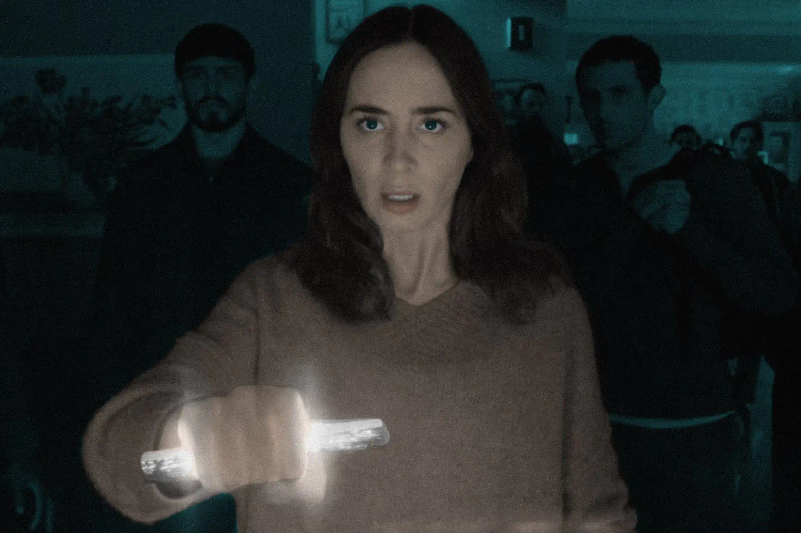

Months ago, I came across a trailer for [Disclosure Day](https://www.youtube.com/watch?v=UFe6NRgoXCM). The trailer had all the ingredients for a movie that I would enjoy, including Spielberg as the director, John Williams as the composer, starring Emily Blunt, aliens, intrigue, and science fiction. I tremendously enjoy the work of Spielberg (Raiders of the Lost Ark, Minority Report). When tickets became available, I told myself, say no more, take my money, and I quickly booked a seat at the nearest IMAX theatre. I had high hopes and expectations.

The trailer genuinely filled me with wonder. In the early version of the trailer, aliens were not even mentioned. That brief scene with Emily Blunt making the strange noises stirred up great intrigue in me. I wanted to see the movie because I wanted to be filled with a sense of discovery. Having finally watched it, the film simply does not deliver. I felt like everything in the movie was pointing towards something much more profound, but never fully bringing the viewer to that destination.

The movie started strong. I was immediately thrown into a tense scene between Daniel vs Noah and his goons. There were multiple points of intrigue. What was that small cylindrical piece that Daniel held that struck such fear into everyone? What was the “truth” that was being hidden? I felt like I hit the ground running. The movie does a good job of moving the plot along without wasting time on exposition. I quickly learnt that there are good guys (the ones who wanted disclosure), and bad guys (the ones who wanted the secrets kept hidden). The film was setting up for a satisfying pay off at the end.

However, as the plot marched on, the movie started to feel less like a display of intrigue and wonder, and more like a frustrating list of weak points and unanswered questions.

For starters, the antagonist (CEO Noah and Wardex) is annoyingly weak. His men in black are super incompetent. They failed to notice Daniel sneaking around a board fence and let him steal one of their cars. They saw that same car drive into the river, and never considered that Daniel and Jane (who were simply hiding behind a rock nearby) could have jumped out before the cliff. For the final 15 mins of the movie, Noah just gave up, sat on the chair, and watched Margaret and Daniel release everything to the news networks.

The motivations behind the major plot reveals are not clearly explained. Why did the aliens want to imbue Margaret and Daniel with those powers? Why did it take so long for the powers to manifest? What was the endgame? And let’s talk about Margaret. Her superpower is… weird. She seems to be able to control people, but the mechanism is not clear. In fact, the way she uses her power is borderline goofy. She rocks up to an army base, rattles off the guard’s name and personal PIN, and the guard lets her through. Shouldn’t you be extra doubtful of this civilian, who almost crashed into the barrier, and does not state her purpose in the military base, even though she knows something secret? Margaret then appears to Noah as his deceased wife, and suddenly Noah folds to her. What does appearing as a person’s deceased wife have to do with their free will? It doesn’t make sense.

Source: Universal Pictures.

In many articles about the movie, a screengrab shows Emily Blunt’s character Margaret holding a strange object that glows. This is one of three alien artefacts that appear throughout the movie. The movie never explains what they are, what they can do, or how to use them. They seem capable of anything, from “diving” into people’s minds, to performing a [Mission Impossible IV invisibility illusion](https://iantsybulkin.medium.com/the-optical-illusion-from-mission-impossible-iv-how-it-might-work-62fb83bf2427), to turning the power back on.

Several scenes also seemed loaded with significance, but there was no pay off later. One of the men in black grabbed the artefact, vanished in a puff of black smoke, and reappeared on the ground moments later. What happened? What was the crop circle generation scene around Daniel for? What was that moment in the train when Margaret was having a panic attack all about? For a moment, I thought Daniel was going to play the piano to calm her down.

All these flaws would have been redeemed if the ending had been great with a fantastic pay off. But the ending left me feeling empty and underwhelmed. Margaret looked into the camera and said “Listen”. There was no satisfying conclusion, no explanation, and I left the cinema with more questions than answers. Sometimes, that’s a good thing. With Inception, my friends would discuss for weeks whether they were in a dream or not. But this time, I just felt that the whole film was evasive about what it was really trying to reveal, rather than being something profound.

After the movie, I jotted down my thoughts. Then, I went to [imdb.com](http://imdb.com)’s user reviews section to see what others were saying. I saw two titles that resonated strongly with me: “Disclosure: nothing is disclosed” and “I wanted to be awestruck by Spielberg but instead I was dumbstruck”. Those couldn’t have more perfectly captured how I felt about the movie.
